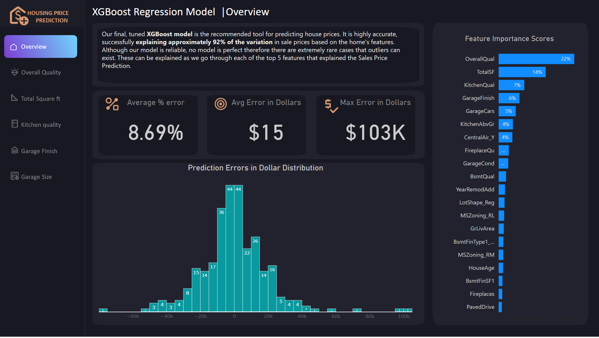
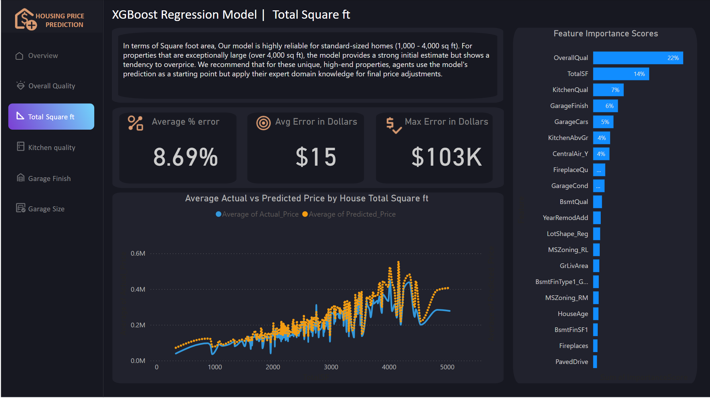

# Ames Housing Price Prediction: An End-to-End Regression Analysis

This project was created for *Ames Real Estate Partners*, a fictional real estate agency. Their pricing strategy relied heavily on agent intuition often inconsistent and hard to justify with clients. The goal was to build a data-driven model that could predict home prices more reliably and consistently across listings.

The project follows a full data science lifecycle: from loading and exploring the data, through feature engineering and model training, to delivering a final regression model tuned for performance and interpretability.

---

## Project Goal

The project answers two key questions:
1. **Can we build a regression model that predicts house prices with accuracy and consistency?**
2. **Which features most strongly influence a home’s sale price?**

---

## 1. Setup and Data Loading

The first phase focused on preparing the programming environment and getting familiar with the dataset.

- Imported essential libraries: `pandas`, `numpy`, `matplotlib`, and `seaborn`
- Loaded the `train.csv` dataset into a pandas DataFrame
- Used `.head()`, `.info()`, `.describe()`, and `.isnull().sum()` to:
  - Understand the structure and data types
  - Spot early signs of missing data
  - Get a feel for the numerical distributions

This initial inspection laid the groundwork for data cleaning and EDA.

---

## 2. Exploratory Data Analysis (EDA)

The goal of this phase was to identify patterns, test assumptions, and uncover the most predictive features.

- **Analyzed the Target Variable:** SalePrice was heavily right skewed. We noted this early for later transformation.
- **Identified Top Numerical Features:** Using a correlation matrix, we ranked numerical variables based on their linear relationship with SalePrice.
- **Categorical Impact:** Calculated median SalePrice per category for fields like `Neighborhood`, `KitchenQual`, and `GarageFinish`.
- **Visual Exploration:** Created scatter plots and boxplots to confirm relationships, assess linearity, and detect significant outliers.

The insights from this phase directly informed our feature engineering and modeling strategies.

---

## 3. Data Preparation and Feature Engineering

With our raw data understood and cleaned, we shifted to preparing it for modeling.

### a. Feature Engineering
We created new variables to capture meaningful patterns:
- **`TotalSF`**: Combined basement, first, and second floor areas into one measure of total square footage.
- **`HouseAge`**: Calculated as the difference between `YrSold` and `YearBuilt`.

We also reassessed outliers using correlation and distribution plots.

### b. Feature Preparation & Encoding
To make all features model ready:
- **Ordinal Encoding**: Applied to rank based categories like `ExterQual` and `GarageCond`.
- **One Hot Encoding**: Used for nominal variables like `Neighborhood`, ensuring models don’t misinterpret arbitrary numeric mappings.
- **Dropped `Id`** as it had no predictive value.

### c. Target Variable Transformation
To address the skewed distribution of `SalePrice`, we applied a log transformation (`np.log1p`). This normalization helped meet assumptions for linear regression and improved model stability.

---

## 4. Model Training and Evaluation

We evaluated three regression models on the cleaned and engineered dataset:
1. **Linear Regression** – served as our baseline model.
2. **Random Forest** – introduced non linear modeling power.
3. **XGBoost** – our final, tuned model using `GridSearchCV`.

We split the data into training and test sets using `train_test_split`, ensuring unbiased performance measurement. XGBoost was ultimately selected for its balance of accuracy, interpretability, and generalization.

---

## Final Results

- **Best Model:** Tuned XGBoost
- **R² Score on test set:** ~91% (92.5% when we undo the logistic transformation)
- **RMSE (test data):** ~$20,350

### Most Influential Features: 
Based on model importance and earlier correlation analysis:
- `OverallQual`
- `TotalSF` 
- `KitchenQual`
- `GarageFinish`
- `GarageCars`

---

## Business Impact

The model provides Ames Real Estate agents with a reliable pricing tool, replacing guesswork with data backed estimates. It also offers transparency like helping agents explain that overall quality influence its value, and where investments (like kitchen upgrades) are likely to pay off. 
Visualizations from PowerBI is also implemented to provide more insights to the model and its limitations. And how to use each features to have the most accurate pricing.

---

## Technologies Used

- Python
- pandas & numpy
- matplotlib & seaborn
- scikit-learn
- XGBoost
- JupyterLab
